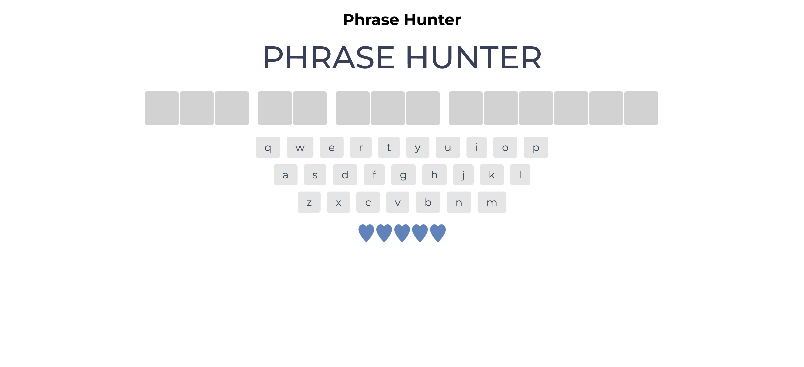
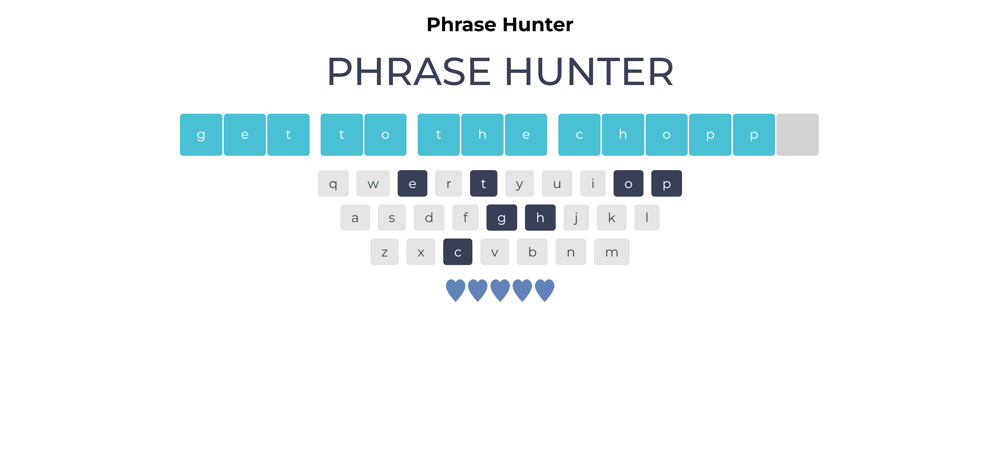
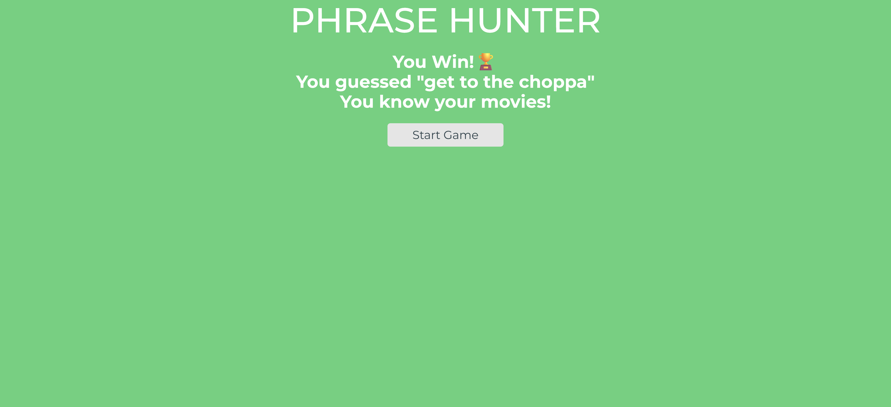
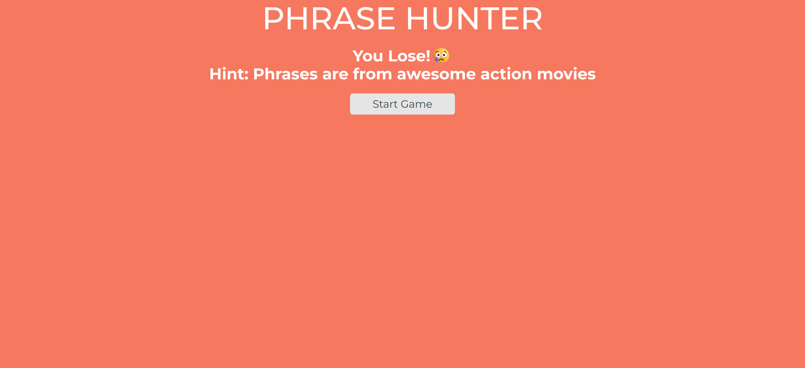

# Phrase Hunter

## Overview

This is a simple guessing game built using Object-Oriented Programming (OOP) principles in JavaScript. Players guess letters in a hidden phrase that I've derived from popular action movies. The game tracks player guesses, displays matched letters, and provides a visual representation of remaining lives. This was my 4th project in the [Treehouse](https://teamtreehouse.com/) full stack JavaScript techdegree program, in which we learned object oriented programming with JavaScript.

## Features

- **Random Phrase Selection**: Each game begins with a randomly selected phrase from a predefined list.
- **Dynamic UI Updates**: The game interface updates in real-time as players make guesses.
- **Visual Feedback**: Players receive immediate feedback on their guesses, along with a visual representation of lives remaining.
- **Game Reset**: The game can be reset and played again without reloading the page.

## Technologies Used

- HTML
- CSS
- JavaScript

## Getting Started

### Prerequisites

Make sure you have a modern web browser to run the application.

### Installation

1. Clone the repository or download the ZIP file.
2. Open `index.html` in your web browser.

## Usage

1. Click the "Start Game" button to begin.
2. Use the onscreen keyboard or your physical keyboard to guess letters in the hidden phrase.
3. If you guess a letter correctly, it will be revealed in the phrase.
4. If you guess incorrectly, you will lose a life. The game ends when you either reveal the entire phrase or lose all lives.

## Example

Here is a preview of the app:

<!--  -->

|    |     |
| -------------------------------------------------------- | --------------------------------------------------------- |
|  |  |

## Acknowledgments

- Thanks to the [Treehouse](https://teamtreehouse.com/) coding community for providing invaluable resources and support.
